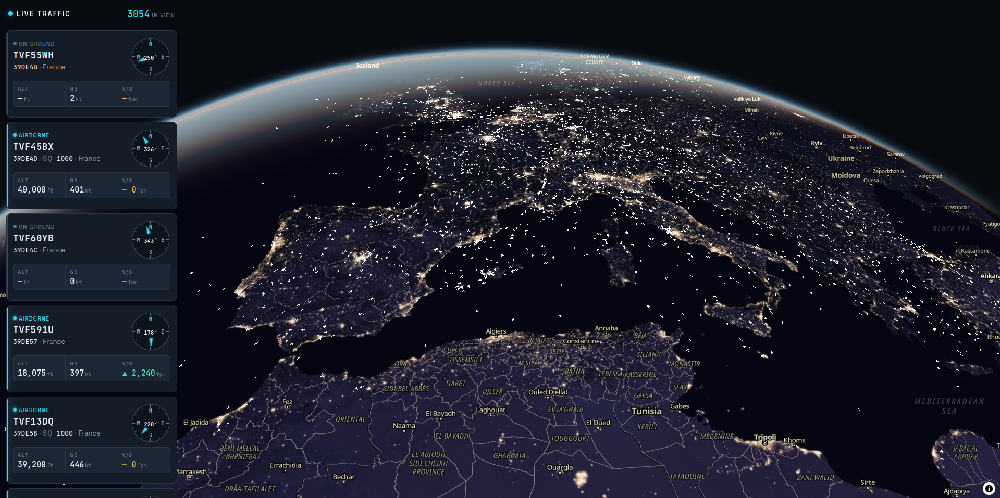

# Airspace Visualization

Live air traffic rendered on an interactive 3D globe. Aircraft stream in from the backend's
air traffic sources and are drawn in real
time — as 3D models when you zoom in, as lightweight sprites when you zoom out — with a
side panel of live flight cards for everything currently in view.

**[Live demo →](https://airspace.juanesroig.com)**



## Features

- **3D globe** built on MapLibre GL with a globe projection and a design-system-tinted atmosphere.
- **Two-mode rendering that swaps at zoom 7.** Zoomed in: real glTF airplane models in a
  Three.js scene sharing MapLibre's WebGL context. Zoomed out: 2D sprites on a symbol layer.
- **Per-frame position interpolation.** Between backend updates, each aircraft is
  dead-reckoned forward from its heading and speed and smoothly `lerp`'d, so motion stays
  fluid instead of jumping on each poll.
- **Live flight cards** for aircraft in the current viewport — callsign, altitude, ground
  speed, vertical rate, squawk, and an SVG compass — lazy-loaded as you scroll.
- **Bidirectional selection.** Hovering or selecting a card highlights the aircraft on the
  map and vice versa; selecting one flies the camera to it.

## Tech stack

React 19 · TypeScript · Vite · MapLibre GL · Three.js

## Getting started

```bash
npm install
npm run dev
```

The dev server runs on Vite's default port. **The frontend needs a backend to show any
data** — see below.

### Scripts

| Command | Description |
| --- | --- |
| `npm run dev` | Start the Vite dev server. |
| `npm run build` | Type-check (`tsc -b`) then build for production. |
| `npm run preview` | Serve the production build locally. |
| `npm run lint` | Run ESLint over the repo. |

## Backend dependency

This frontend is a client only — it does **not** talk to any air traffic provider directly.
It expects a separate backend that aggregates several sources and pushes them over
**Server-Sent Events**, with named `success` / `error` events. The `success` event carries a
bare array of objects matching the `AircraftState` type in [`src/api.ts`](src/api.ts) —
keyed by `hex`, with `alt` in meters, `speed` in km/h, `v_speed` in m/s and `dir` in
degrees. Most fields are optional: aircraft without a position are skipped, and a missing
`speed` — 41% of airborne records in a live sample — is estimated from altitude so the
aircraft still moves, shown on the card with a `~` to mark it as a guess.

The backend base URL is configured with an environment variable (below). With no backend
reachable, the app shows its "Couldn't connect to live traffic" state.

## Environment variables

Copy `.env.example` to `.env` and fill in the values. Vite only exposes variables prefixed
with `VITE_`.

| Variable | Required | Description |
| --- | --- | --- |
| `VITE_API_URL` | Production | Base URL of the backend (no trailing slash), e.g. `https://your-backend.example.com`. Defaults to `http://localhost:5000` when unset, so local dev works out of the box. |

> **Deploying:** a deployed frontend is served over HTTPS, so `VITE_API_URL` must point at an
> **HTTPS** backend — browsers block plain-`http` (and thus `localhost`) requests from an
> HTTPS page. Set `VITE_API_URL` at build time on your host.

The basemap uses a hardcoded [MapTiler](https://www.maptiler.com/) style URL and key in
[`src/main.tsx`](src/main.tsx). If you deploy this, restrict that key to your domain in the
MapTiler dashboard so it can't be reused elsewhere.

## Architecture

Data flows: **backend SSE → `App.tsx` → `AircraftLayer`**.

- **`index.html`** stacks two DOM layers: `#map` (the MapLibre globe) under `#root` (the React
  UI). `main.tsx` creates the `Map` instance and passes it into `<App map={map} />` — React
  drives the map, it doesn't own it.
- **[`src/map.ts`](src/map.ts) — `AircraftLayer`** is the rendering engine: it registers the
  custom WebGL layer and the symbol layer, keeps both in sync from a single
  `Map<hex, ...>`, interpolates positions every frame, and does mode-dependent picking
  (Three.js `Raycaster` when zoomed in, `queryRenderedFeatures` when zoomed out).
- **[`src/App.tsx`](src/App.tsx)** owns UI state and wires MapLibre events to the layer.
- **[`src/api.ts`](src/api.ts)** types the states wire format and fills the gaps in it (`aircraft_speed`).
- **[`src/utils.ts`](src/utils.ts)** holds the math (`lerp`/`remap`, great-circle dead reckoning).

See [`CLAUDE.md`](CLAUDE.md) for a deeper tour.
